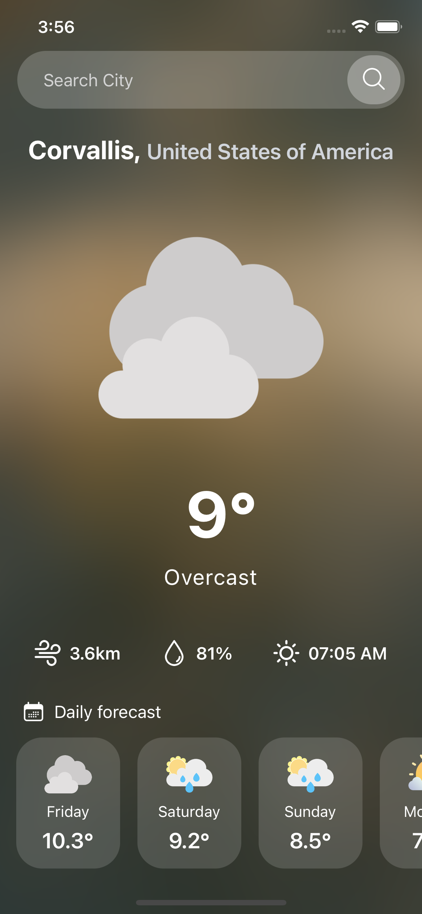
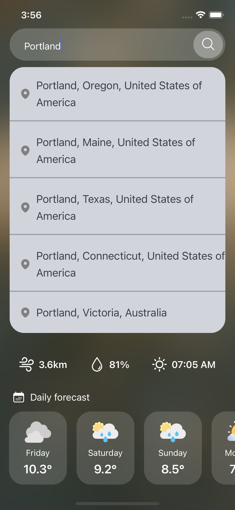

# Vreme | Weather App

## About Vreme

Vreme is a fully functional weather application developed using the popular React Native framework & designed using NativeWind and TailwindCSS. This application allows users to check weather for a city and also have a 7-day weather forecast for the city. This Weather API is provided by the [WeatherAPI](https://weatherapi.com).

## Vreme Application Screenshots

<table>
  <tr>
    <td>
      
    </td>
    <td>
      
    </td>
  </tr>
</table>

## Installation

### Clone the repository
To get started, you'll need to clone this repository to your local machine. You can do this by running the following in the command line:

```bash 
git clone https://github.com/Sumer16/vreme.git 
```

### Install dependencies

Once you've cloned the repository, navigate to the project directory and run npm/yarn install to install all the necessary dependencies.

```bash
cd vreme

npm install
# or
yarn install
```

### and then

Go to [WeatherAPI](https://www.weatherapi.com) to create an account and get the API key. Use that API key in constants/index.js file

### Setup the environment variables

After the dependencies have been installed, create a ```.env``` file in the root of the project and add all necessary API credentials of your own:

```env
WEATHER_API_KEY=your_own_key
```

### Run the App

After the dependencies have been installed, you can run the app in development mode by running:

```bash
npm run start
# or
yarn start
```

Open your app in the [Expo app](https://expo.io) on your phone to view it. It will reload if you save edits to your files, and you will see build errors and logs in the terminal.

If you want to run your application on an iOS device then use these commands:

```bash
npm run ios
# or
yarn run ios
```

These commands are like `npm start` / `yarn start`, but attempts to open your app in the iOS Simulator if you're on a Mac and have it installed.

If you want to run your application on an iOS device then use these commands:

```bash
npm run android
# or
yarn run android
```

These commands are like `npm start` / `yarn start`, but attempts to open your app on a connected Android device or emulator.

### This requires an installation of Android build tools (see [React Native docs](https://facebook.github.io/react-native/docs/getting-started.html) for detailed setup).
